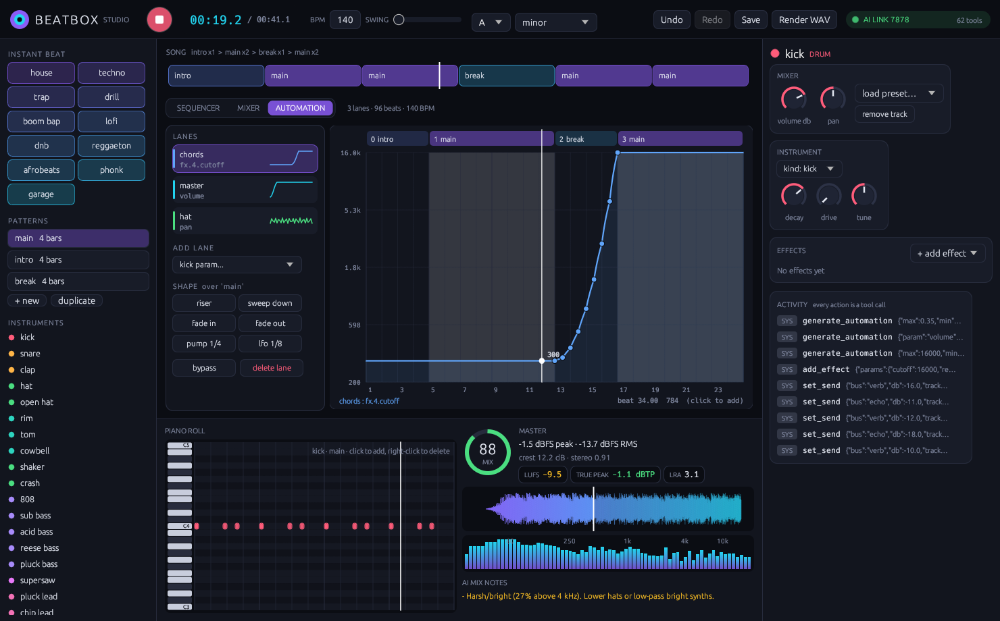

# Beatbox 🥁

**An AI-native beat maker written in Rust.** Every feature — synths, drums, samples, effects, music theory, arrangement, mixing and mix analysis — is a tool an AI model can call over [MCP](https://modelcontextprotocol.io). Humans get a CLI and a native desktop studio (egui) on the same engine, and can watch an AI produce live.

> FL Studio was built for hands on a mouse. Beatbox is built for models: every knob is addressable, every action is undoable, and the engine can *listen back* to its own mix and tell the AI what to fix.




## Why it's different

| | Typical DAW | Beatbox |
|---|---|---|
| AI control | none / plugins | 163 MCP tools, every feature; `batch` makes 50 edits one atomic undo step |
| Feedback loop | your ears | `analyze_mix`: LUFS, true peak, spectrum balance, stereo, masking, 0-100 score + fixes |
| Trying ideas | save-as copies | `snapshot` A/B variants, `diff_project` structured diffs, `compare_variants` renders and scores each |
| Delivery | trust the meters | `validate_project` / `check_master`: overs, true peak, LUFS target, DC, mono, missing samples, broken routing |
| Sounds | ship with sample packs | synthesizes everything (incl. modelled piano, strings, choir), installs CC0 multisampled orchestral packs, fetches sounds from Freesound or any URL |
| Theory | piano roll | roman-numeral progressions, voice leading, scale-locked melodies |
| Mistakes | Ctrl+Z if you're lucky | every tool call is undoable, failed calls roll back |
| Format | binary project | one readable JSON file |

## Features

- **Realistic acoustic sources** — a modelled acoustic piano (inharmonic stiff strings, 1-3 detuned strings per key, hammer comb + thump, two-stage decay, soundboard; `grand_piano`, `felt_piano`, `upright_keys`), modelled ensembles (strings / choir / brass sections with per-player vibrato, drift and onset jitter through body/formant spectra: `string_section`, `staccato_strings`, `cello_section`, `choir`, `choir_aah`, `brass_section`), and a **multisample** engine (key zones x velocity layers with crossfades x round robin, SFZ loading). `install_instrument_pack` downloads real CC0 instruments from VSCO 2 Community Edition (upright piano, violin/viola/cello sections sustain/spiccato/pizzicato/tremolo, harp, woodwinds, brass) and maps the zones from the file names, recording the licence.
- **More synth engines** — band-limited **wavetable** synth with 6 morphing tables (position envelope / LFO, automatable), **granular** sampler (grain size, density, position, spray, scan, reverse), **layer** instrument (stack up to 4 sources with key/velocity splits and per-layer delay), stereo unison spread on synths, and **808 / synth glides** (`slide_to` on notes, `glide_ms`).
- **Instruments** — 10 synthesized drum voices (808-style kick, snare, clap, metallic hats, rim, tom, cowbell, shaker, crash), a subtractive synth (polyBLEP oscillators, 9-voice unison/supersaw, SVF filter with envelope + LFO, sub, drive), FM synth (e-piano, bells, mallets), Karplus-Strong plucked strings, an 808 bass, and a pitched sampler. 28 presets.
- **Studio effects** — N-band parametric EQ (bell / shelves / 12-48 dB cuts / notch), 3-band multiband compressor, dynamic EQ, de-esser, soft clipper (oversampled), gate, phaser, flanger, gross-beat-style **stutter** (gate pattern / stutter / half-time / reverse / tape stop, tempo-synced), granular pitch shifter, **convolution reverb** with synthesized room / hall / plate / chamber / spring / cathedral IRs (partitioned FFT), tempo-synced auto-pan / tremolo. Every effect can be bypassed; `describe_effect` / `describe_instrument` return parameter schemas (type, range, unit, enum options) and `set_parameters` changes many at once, atomically.
- **Effects** — filter, 3-band EQ, distortion, bitcrush, tempo-synced ping-pong delay, Freeverb reverb, chorus, compressor, **sidechain ducking**, stereo width, transient shaper, lookahead limiter. Per track and on the master.
- **Generators** — 11 drum styles (house, techno, trap, drill, boom bap, lofi, dnb, reggaeton, afrobeats, phonk, garage), basslines that follow a progression (808, offbeat, walking…), chords with smooth voice leading (block, stabs, arps…), melodies with motif repetition and chord-tone targeting, and `generate_beat` for a full arranged song in one call.
- **Samples from the internet** — `search_samples` on Freesound (CC0-only by default), `download_sample` by id or any audio URL; wav/mp3/flac/ogg decoding; licenses tracked for credits.
- **Ears** — `analyze_mix` reports peak/RMS, crest factor, energy across sub/bass/low-mid/mid/presence/air, stereo correlation, per-track energy share, low-end masking, and concrete suggestions.
- **Song structure** — patterns (1–64 bars), copy-to-vary, arrangement, WAV render and stem export. `build_structure` turns one full pattern into intro / verse / build / hook / bridge / outro sections by musical role, varies repeats and adds transitions; `add_transition` writes risers, reverse cymbals, impacts, downlifters, fills, filter builds, stutters, tape stops and drop gaps at a boundary (shared patterns are split so only that boundary changes).
- **Piano roll** — select notes by range / pitch / velocity and edit, delete, quantize (strength + swing), split / merge / legato, arpeggiate, strum, rolls / ratchets / flams, chord voicings (inversions, drop-2/3, spread), diatonic harmonize, key detection, velocity shaping, grooves (MPC swing, lazy/Dilla, push) and per-note **probability** and **microtiming**; variations, fills and counter-melodies that stay in key. Standard MIDI File **import / export**.
- **One idea = one call** — `write_riff` (chord-relative figure over a progression, any rhythm, many sections at once), `add_roll`, `write_phrase` (motif repeated with variation / sequence), `copy_notes` (one track between patterns), `add_slides`, `set_section_mix`, `batch`.
- **Samples** — transient `slice_sample` into a playable slice kit, WSOLA `stretch_sample` (tempo-match a loop) and pitch shift, `edit_sample` (trim silence, region in seconds or beats, reverse, fades, normalize peak / LUFS, high-pass), `analyze_audio` (BPM, key, onsets, LUFS, spectrum, width of any sample, file or the mix).
- **Automation** — lanes on any track, bus or the master for `volume`, `pan`, any numeric instrument parameter (`instrument.cutoff`, `instrument.amp_env.release`; sampled per note) or any numeric effect parameter (`fx.0.cutoff`, `fx.2.mix`; evaluated every 64 samples). Breakpoints in song beats with linear / step / smooth curves. `generate_automation` writes musical shapes over a section: riser, sweep down, fade in/out, tempo-synced pump and LFO (`1/8`, `1/4t`, `2 bars`), with log-scaled frequency sweeps.
- **Buses, sends and returns** — named buses with their own effect chains (reverb/room/delay returns, drum bus, parallel comp, glue presets), per-track pre/post-fader sends in dB and output routing to a bus; buses sum into the master before the master chain.
- **A/B variants + diff** — `snapshot` named versions (persisted next to the project by `save_project` and restored by `load_project`), `restore_snapshot` (undoable), `diff_project` returns changes in producer terms (`tracks.bass.volume_db -2 -> -5`, `patterns.A.clips.kick +4 notes`), `compare_variants` renders each version and ranks them by mix score, LUFS and true peak.
- **Robust analysis** — the analyzer measures each track during the render instead of keeping every stem in RAM (a 31-track, 3-minute song no longer exhausts memory), per-track `active_rms_db` / `active_percent` read sparse parts honestly, a panicking tool returns an error instead of killing the MCP server, and every mutation returns its `revision` and an exact `changes` list.
- **Validation + mastering QC** — integrated loudness (ITU-R BS.1770 K-weighting with gating), short-term max, loudness range, 4x-oversampled true peak, DC offset, mono fold-down, silence detection; structural checks for missing samples, broken sends/routing, dead automation, NaN or out-of-range values, notes outside patterns, empty or muted tracks. Every item says pass / warn / fail and which tool fixes it.
- **AI ears (sprint 5)** — `analyze_sections` (per-section LUFS, short-term max, true peak, band balance, top tracks, deltas and flags like *hook not louder than verse*), windowed `analyze_mix`, `detect_artifacts` (clicks, DC steps, end-level jumps after a fade, truncated tails, sustained/looped hiss beds with per-track culprits), `render_spectrogram` and `render_preview` returned as **MCP image / audio content blocks**, `waveform_peaks`, `spectrum`, `eq_curve`, `analyze_track` (YIN fundamental, nearest note vs key, decay), `detect_transients`, `strip_silence`. Key detection uses bass-weighted chroma and reports the top 3 with a confidence margin.
- **Mix balance (sprint 5)** — presets start at calibrated role levels (`add_track` sets the fader; `level_hints` checks levels without a render), `balance_mix` gain-stages the song to genre targets relative to the kick, kick/bass masking is measured after sidechain ducking, suggestions are arrangement-aware.
- **Delivery (sprint 5)** — `export_audio` wav (16/24/32f) / flac (built-in encoder) / mp3 (ffmpeg): target LUFS, true-peak limiting, then encode → decode → re-measure → trim until the *decoded* true peak meets the ceiling; TPDF dither. `export_stems` with bus/return stems, pre/post-master modes and a sum-to-master null check. `master_assistant` (true-peak limiter last, style stage, iterative loudness), `analyze_reference` / `compare_to_reference`. The limiter verifies itself with a 4x oversampled true-peak meter.
- **DSP from SoundCraft (MIT/Apache)** — Kaiser windowed-sinc resampler (sample import and multisample pitching), 8-line FDN reverb (`reverb {mode: fdn_room|fdn_plate|fdn_hall, decay_s}`), soft-knee lookahead compressor with sidechain HPF and parallel mix, YIN pitch detection, spectral-flux transients, TPDF dither and FLAC. See THIRD_PARTY_NOTICES.md.
- **Strict, stable parameters** — unknown top-level or nested parameters are rejected with the valid names (never silently dropped), `add_effect` / `tweak_effect` echo the effective values, and every effect has a stable id (`reverb1`) usable anywhere an index is (`tweak_effect {index:"reverb1"}`, automation `fx.reverb1.mix`); old projects get ids on load.
- **Studio parity** — `transport` (play / stop / seek over the live link), `get_history`, `screenshot` (studio view as an MCP image), `render` with a region and tail.
- **Studio** — native egui desktop app: arrangement strip, step sequencer, piano roll, **mixer** (channel strips with live meters from stems, faders, pan, sends, bus and master strips with LUFS / true peak), **automation editor** (lane list, curve view over the song with sections, click to add points, one-click shapes), inspector with knobs, live waveform / spectrum, mix score and the AI activity feed. Every click is a tool call, so the AI and you share one undo history.

## Quick start

The toolchain is pinned in `rust-toolchain.toml` (the version CI builds with); rustup picks it up automatically. Build against the committed lockfile:

```bash
cargo install --path . --locked                         # desktop studio + CLI + MCP
cargo build --release --no-default-features --locked    # headless (CLI + MCP only, no GUI deps)
# if release linking fails with LTO (some linkers / low-RAM machines):
CARGO_PROFILE_RELEASE_LTO=false cargo build --release --no-default-features --locked
```

MP3 export needs `ffmpeg` on PATH; WAV and FLAC are built in.

```bash

# a full trap beat, rendered and scored
beatbox beat trap --key A -o trap.wav --save trap.json

# call any tool from the shell
beatbox call add_effect '{"track":"lead","type":"reverb","params":{"size":0.9}}' --project trap.json
beatbox analyze trap.json
beatbox tools            # everything an AI can do
```

## Use it from an AI (MCP)

Add to Claude Desktop / Cursor / any MCP client:

```json
{
  "mcpServers": {
    "beatbox": { "command": "beatbox", "args": ["mcp"] }
  }
}
```

Then ask: *"Make a dark phonk beat at 130 BPM, sidechain the 808 to the kick, check the mix and fix whatever it complains about."*

Set `FREESOUND_API_KEY` (free at freesound.org/apiv2/apply) to let the AI pull real sounds.

## Why Beatbox beats FL Studio for AI

- **Every action is a typed MCP tool.** 163 tools with JSON schemas cover the whole DAW, so a model drives it directly instead of clicking pixels or scripting around a GUI.
- **AI ears with ranked verdicts and fix calls.** `ears_report`, `diff_renders`, `masking_matrix`, `loudness_report`, `groove_analysis` / `hook_analysis` / `structure`, `stereo_image`, `punch`, `vocal_pocket` and `reference_match` return ranked problems, each with the exact tool call that fixes it.
- **Diff-verified revisions.** `produce_track` runs render → critique → `diff_renders` against the best render so far, and keeps a revision only when the ears agree it is better.
- **Nine genre playbooks.** trap, melodic_rap, drill, boom_bap, desi_hiphop (sitar, tabla, tanpura drone), lofi, rnb, phonk and afrobeats, readable with `describe_genre`.
- **Sample flip and vocal chop.** `flip_sample` and `vocal_chop` turn a sample or vocal into playable chops.
- **FL-style workflow, as tools.** Playlist pattern clips, automation clips and mixer bus routing (`place_pattern`, `create_automation_clip`, `route_bus`) with cycle checks.
- **Deterministic project JSON.** The whole song is one readable, stable JSON file, so every change can be diffed, reviewed and undone.

## Tool surface (163 tools)

Discovery `get_guide` `list_presets` `list_tools` · Project `new_project` `get_project` `save_project` `load_project` `set_tempo` `set_key` `undo` `redo` `batch` · Tracks `add_track` `remove_track` `set_instrument` `tweak_instrument` `set_mixer` · Sound design `design_sound` `layer_instrument` `create_macro` `set_macro` `describe_instrument` `set_parameters` · Multisample `add_multisample_track` `install_instrument_pack` · FX `add_effect` `tweak_effect` `remove_effect` `get_effects` `describe_effect` `bypass_effect` `reorder_effects` · Patterns `add_pattern` `remove_pattern` `set_pattern_length` `set_steps` `toggle_step` `add_notes` `clear` `get_pattern` `transpose` `humanize` · Piano roll `edit_notes` `delete_notes` `quantize` `split_notes` `merge_notes` `legato` `arpeggiate` `strum` `roll_notes` `chord_voicing` `harmonize` `detect_key` `velocity_curve` `apply_groove` · Writing `write_riff` `add_roll` `write_phrase` `copy_notes` `add_slides` · Generators `generate_drums` `generate_bassline` `generate_chords` `generate_melody` `generate_beat` `generate_variation` `generate_fill` `counter_melody` · Theory `theory_scale` `theory_chords` · Song `set_arrangement` `build_structure` `vary_section` `add_transition` `set_section_mix` · MIDI `import_midi` `export_midi` · Samples `search_samples` `download_sample` `import_sample` `list_samples` `add_sample_track` `slice_sample` `stretch_sample` `edit_sample` `analyze_audio` · Output `render` `analyze_mix` · Automation `add_automation` `set_automation_points` `clear_automation` `list_automation` `generate_automation` · Routing `add_bus` `remove_bus` `set_send` `route_track` `list_routing` · Variants `snapshot` `list_snapshots` `restore_snapshot` `diff_project` `compare_variants` · QC `validate_project` `check_master` · Ears `analyze_sections` `detect_artifacts` `render_spectrogram` `render_preview` `waveform_peaks` `spectrum` `eq_curve` `analyze_track` `detect_transients` `strip_silence` · Mix `level_hints` `balance_mix` · Delivery `export_audio` `export_stems` `master_assistant` `analyze_reference` `compare_to_reference` · Studio `transport` `get_history` `screenshot` · Producer `produce_track` `plan_track` `apply_plan` `critique_track` `revise_track` `list_genres` `describe_genre` `install_kit` `index_samples` `find_samples` `flip_sample` `vocal_chop` · Listen `ears_report` `diff_renders` `loudness_report` `masking_matrix` `groove_analysis` `hook_analysis` `structure` · Ears pro `stereo_image` `punch` `vocal_pocket` `reference_match` · Playlist & FL parity `place_pattern` `arrangement_to_playlist` `list_playlist` `remove_clip` `clear_playlist` `create_automation_clip` `place_automation_clip` `list_automation_clips` `route_bus` `scale_snap` `generate_ghost_notes` · FX placement `place_fx` `move_effect` `ab_compare`

## Architecture

```
            ┌──────────── CLI ────────────┐
 MCP client ┤                             ├─► Engine::call(tool, json) ─► tools registry
            └── Studio (native GUI) ──────┘        │  undo/redo, rollback on error
                                                   ▼
          theory ─► project (JSON) ─► render: instruments → automation → fx → fader
                                        → sends / bus routing → buses → master → WAV
                                                   ▼
                               analysis ("ears": LUFS, true peak) + validate (QC)
```

## Roadmap

- [x] Engine, MCP tools, CLI
- [x] Native desktop studio (egui): step sequencer, piano roll, knobs, mixer, live waveform/spectrum, live AI activity feed
- [x] Studio ↔ MCP live link (`beatbox mcp --connect`) so you watch the AI produce
- [x] Automation lanes, buses/sends/returns, A/B snapshots + diff, validation and master QC
- [x] Piano roll + MIDI import/export, song structure + transitions, studio FX rack, wavetable / granular / modelled piano + ensembles / multisample instruments, sample slicing and stretching, persistent snapshots, batch
- [x] Sprint 5: AI ears (sections, artifacts, spectrogram/preview as MCP media), delivery (codec-aware export, stems, master assistant, reference compare), SoundCraft DSP ports, balance tools, strict params, stable effect ids, transport/history/screenshot
- [x] Sprint 6-7: `produce_track` autonomy loop with diff-verified revisions, AI ears v2/v3, nine genre playbooks, sample flip / vocal chop, FL parity (playlist pattern clips, automation clips, bus routing), saturator + haas, loudness-matched A/B
- [ ] Persistent ids for tracks/clips/notes, clip timeline, scoped edits, golden-render tests

## License

MIT © Naman Sharma

## Sound palettes

`list_palettes` / `apply_palette` swap a project's voices by role to a curated palette: **dark_trap**, **dhh_grit**, **boom_bap_dusty**, **drill_slide**, **melodic_airy** (level-matched, Indian instruments and featured modelled instruments kept). `use_samples:true` uses each palette's CC0 one-shot kit (fetched once, SHA-256 checked; see SAMPLES_LICENSES.md). `audition_palette` renders a palette's voices; `install_palette_samples` indexes the 53 curated CC0 one-shots with role/genre/character tags for `find_samples`. The voices themselves: mipmapped band-limited oscillators, layered kicks/snares/claps/hats with round-robin variation and velocity tone, an 808 with sub + driven body + click and legato glides.

