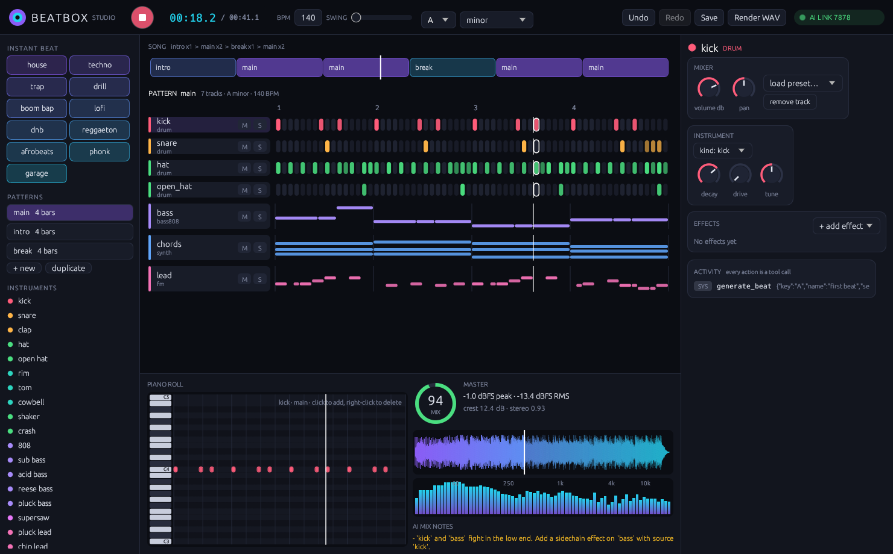

# Beatbox 🥁

**An AI-native beat maker written in Rust.** Every feature — synths, drums, samples, effects, music theory, arrangement, mixing and mix analysis — is a tool an AI model can call over [MCP](https://modelcontextprotocol.io). Humans get a CLI and (soon) a native desktop studio on the same engine.

> FL Studio was built for hands on a mouse. Beatbox is built for models: every knob is addressable, every action is undoable, and the engine can *listen back* to its own mix and tell the AI what to fix.



## Why it's different

| | Typical DAW | Beatbox |
|---|---|---|
| AI control | none / plugins | 45 MCP tools, every feature |
| Feedback loop | your ears | `analyze_mix`: loudness, spectrum balance, stereo, masking, 0-100 score + fixes |
| Sounds | ship with sample packs | synthesizes everything, plus fetches sounds from Freesound or any URL |
| Theory | piano roll | roman-numeral progressions, voice leading, scale-locked melodies |
| Mistakes | Ctrl+Z if you're lucky | every tool call is undoable, failed calls roll back |
| Format | binary project | one readable JSON file |

## Features

- **Instruments** — 10 synthesized drum voices (808-style kick, snare, clap, metallic hats, rim, tom, cowbell, shaker, crash), a subtractive synth (polyBLEP oscillators, 9-voice unison/supersaw, SVF filter with envelope + LFO, sub, drive), FM synth (e-piano, bells, mallets), Karplus-Strong plucked strings, an 808 bass, and a pitched sampler. 28 presets.
- **Effects** — filter, 3-band EQ, distortion, bitcrush, tempo-synced ping-pong delay, Freeverb reverb, chorus, compressor, **sidechain ducking**, stereo width, transient shaper, lookahead limiter. Per track and on the master.
- **Generators** — 11 drum styles (house, techno, trap, drill, boom bap, lofi, dnb, reggaeton, afrobeats, phonk, garage), basslines that follow a progression (808, offbeat, walking…), chords with smooth voice leading (block, stabs, arps…), melodies with motif repetition and chord-tone targeting, and `generate_beat` for a full arranged song in one call.
- **Samples from the internet** — `search_samples` on Freesound (CC0-only by default), `download_sample` by id or any audio URL; wav/mp3/flac/ogg decoding; licenses tracked for credits.
- **Ears** — `analyze_mix` reports peak/RMS, crest factor, energy across sub/bass/low-mid/mid/presence/air, stereo correlation, per-track energy share, low-end masking, and concrete suggestions.
- **Song structure** — patterns (1–64 bars), copy-to-vary, arrangement, WAV render and stem export.

## Quick start

```bash
cargo install --path .

# a full trap beat, rendered and scored
beatbox beat trap --key A -o trap.wav --save trap.json

# call any tool from the shell
beatbox call add_effect '{"track":"lead","type":"reverb","params":{"size":0.9}}' --project trap.json
beatbox analyze trap.json
beatbox tools            # everything an AI can do
```

## Use it from an AI (MCP)

Add to Claude Desktop / Cursor / any MCP client:

```json
{
  "mcpServers": {
    "beatbox": { "command": "beatbox", "args": ["mcp"] }
  }
}
```

Then ask: *"Make a dark phonk beat at 130 BPM, sidechain the 808 to the kick, check the mix and fix whatever it complains about."*

Set `FREESOUND_API_KEY` (free at freesound.org/apiv2/apply) to let the AI pull real sounds.

## Tool surface (45 tools)

Discovery `get_guide` `list_presets` `list_tools` · Project `new_project` `get_project` `save_project` `load_project` `set_tempo` `set_key` `undo` `redo` · Tracks `add_track` `remove_track` `set_instrument` `tweak_instrument` `set_mixer` · FX `add_effect` `tweak_effect` `remove_effect` `get_effects` · Notes `add_pattern` `remove_pattern` `set_pattern_length` `set_steps` `toggle_step` `add_notes` `clear` `get_pattern` `transpose` `humanize` · Generators `generate_drums` `generate_bassline` `generate_chords` `generate_melody` `generate_beat` · Theory `theory_scale` `theory_chords` · Song `set_arrangement` · Samples `search_samples` `download_sample` `import_sample` `list_samples` `add_sample_track` · Output `render` `analyze_mix`

## Architecture

```
            ┌──────────── CLI ────────────┐
 MCP client ┤                             ├─► Engine::call(tool, json) ─► tools registry
            └── Studio (native GUI) ──────┘        │  undo/redo, rollback on error
                                                   ▼
          theory ─► project (JSON) ─► render: instruments → fx → mix → master → WAV
                                                   ▼
                                           analysis ("ears")
```

## Roadmap

- [x] Engine, 45 MCP tools, CLI
- [ ] Native desktop studio (egui): step sequencer, piano roll, knobs, mixer, live waveform/spectrum, live AI activity feed
- [ ] Studio ↔ MCP live link (`beatbox mcp --connect`) so you watch the AI produce
- [ ] Automation lanes, MIDI export, more synth engines (wavetable, granular)

## License

MIT © Naman Sharma
